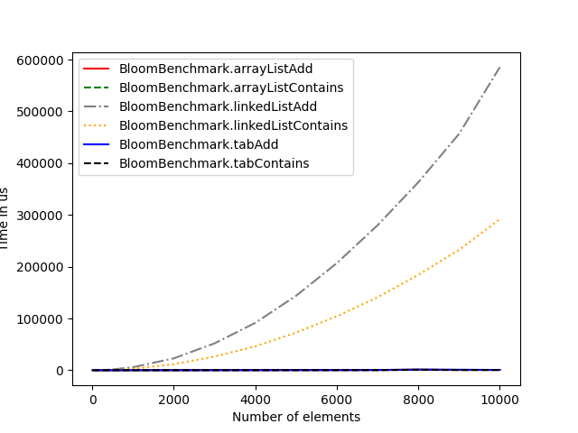

# Bloom Filter in Java

## Context
The goal of this project was to implement a Bloom filter in Java and evaluate its performance using a benchmark.

## What is a Bloom Filter?
A Bloom filter is a space-efficient probabilistic data structure that is used to test whether an element is a member of a set. It is faster than checking if the data is present in the set, but it has a small probability of false positives. It can be used when the small probability of false positives is not a problem / can be double checked, to match an url pattern, for example.
A Bloom Filter uses a byte array to store the data. Each element is hashed and the corresponding bits are set to 1. When checking if an element is present in the set, the element is hashed and the corresponding bits are checked. If all the bits are set to 1, the element is probably present in the set. If at least one bit is set to 0, the element is definitely not present in the set.

## Benchmark
To test the performance of the Bloom Filter, I used a Benchark class. The benchmark uses jmh to measure the average time for adding elements to the Bloom Filter as well as for testing if an element is present in the Bloom Filter. The benchmark has a parameter for the number of elements to add to it to compare the performance with different sizes.

## Results

Here is the result of the benchmark with larger and larger number of elements. We can see that the arrayList is the slowest storage type, with a complexity that seems exponential, while the ArrayList and table storage types seems to have a linear complexity.

## Why does the results differ
The results differ because the linkedList has a complexity of O(n) for adding elements, while the ArrayList and table have a complexity of O(1). 

## What can we learn from this
Using the linkedList for a BloomFilter is suboptimal and should be avoided.