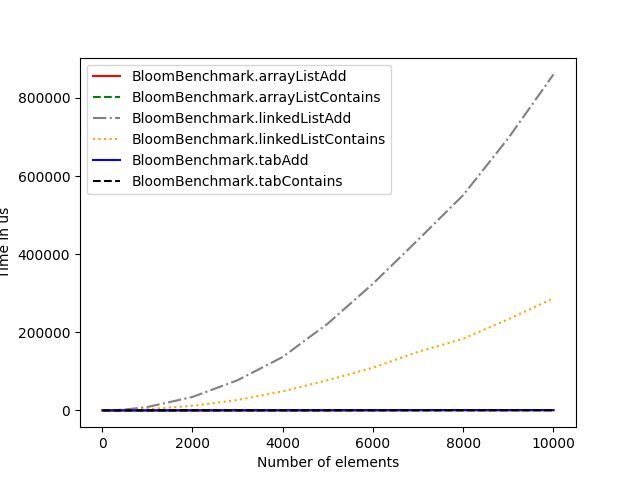

# Bloom Filter in Java

## Context
The goal of this project was to implement a Bloom filter in Java and evaluate its performance using a benchmark.

## What is a Bloom Filter?
A Bloom filter is a space-efficient probabilistic data structure that is used to test whether an element is a member of a set. It is faster than checking if the data is present in the set, but it has a small probability of false positives. It can be used when the small probability of false positives is not a problem / can be double checked, to match an url pattern, for example.
A Bloom Filter uses a byte array to store the data. Each element is hashed and the corresponding bits are set to 1. When checking if an element is present in the set, the element is hashed and the corresponding bits are checked. If all the bits are set to 1, the element is probably present in the set. If at least one bit is set to 0, the element is definitely not present in the set.

## Benchmark
To test the performance of the Bloom Filter, I used a Benchark class. The benchmark uses jmh to measure the average time for adding elements to the Bloom Filter as well as for testing if an element is present in the Bloom Filter. The benchmark has a parameter for the number of elements to add to it to compare the performance with different sizes.

## Results
  
```
BloomBenchmark.arrayListAdd              9000  avgt    5     655,910 ±    254,645  us/op
BloomBenchmark.arrayListContains         9000  avgt    5     571,083 ±    432,155  us/op
BloomBenchmark.linkedListAdd             9000  avgt    5  697121,060 ±  18423,286  us/op
BloomBenchmark.linkedListContains        9000  avgt    5  233350,860 ±   5442,844  us/op
BloomBenchmark.tabAdd                    9000  avgt    5     531,194 ±    287,208  us/op
BloomBenchmark.tabContains               9000  avgt    5     570,148 ±    346,933  us/op
```
Here is the result of the benchmark with larger and larger number of elements. We can see that the arrayList is the slowest storage type, with a complexity that seems exponential, while the ArrayList and table storage types seems to have a linear complexity. There is already a function to calculate the optimal size of the Bloom Filter. It is calculated as 
```java
Math.ceil((n * Math.log(desiredFalsePositiveRate)) / Math.log(1.0 / (Math.pow(2.0, Math.log(2.0)))))
```
where `n` is the number of elements to add to the Bloom Filter and `desiredFalsePositiveRate` is the desired false positive rate (here 0.01).

----
  
```
BloomBenchmark.arrayListAdd              9000  avgt    5      886,423 ±    425,173  us/op
BloomBenchmark.arrayListContains         9000  avgt    5      681,259 ±    460,200  us/op
BloomBenchmark.linkedListAdd             9000  avgt    5  1615438,400 ±  58709,780  us/op
BloomBenchmark.linkedListContains        9000  avgt    5   232086,700 ±   7726,322  us/op
BloomBenchmark.tabAdd                    9000  avgt    5      726,128 ±    512,226  us/op
BloomBenchmark.tabContains               9000  avgt    5      681,557 ±    530,257  us/op
```
I then added a function to calculate the optimal number of hashes as per wikipedia (https://en.wikipedia.org/wiki/Bloom_filter#Optimal_number_of_hash_functions). The optimal number of hashes is calculated as
```java
Math.ceil((m / n) * Math.log(2.0))
```
where `m` is the size of the Bloom Filter and `n` is the number of elements to add to it. I then ran the benchmark again with the optimal number of hashes. We can see that the difference is not very significant, it is within the error margin. The only exception is the linkedList contain, which seems to increase in complexity a lot slower than before.


## Why does the results differ
The results differ because the linkedList has a complexity of O(n) for adding elements, while the ArrayList and table have a complexity of O(1). 

## What can we learn from this
Using the linkedList for a BloomFilter is suboptimal and should be avoided. The algorithmic complexity of the LinkedList is orders of magnitude worse than the complexity of the ArrayList and the table.
